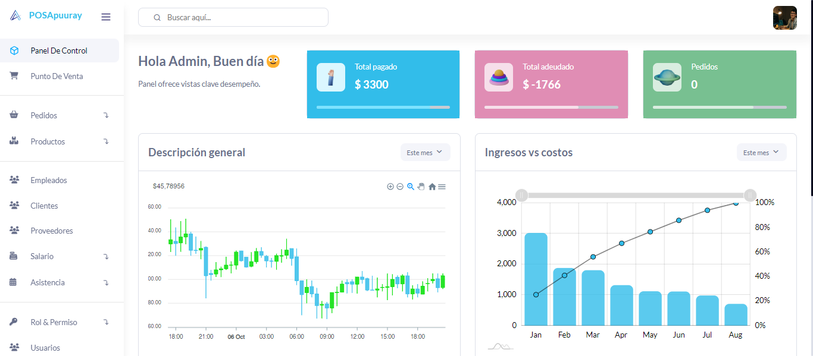
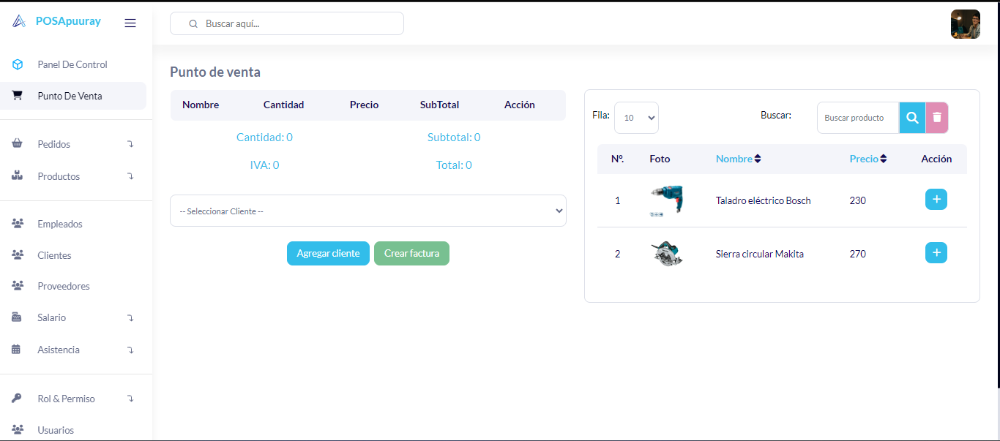
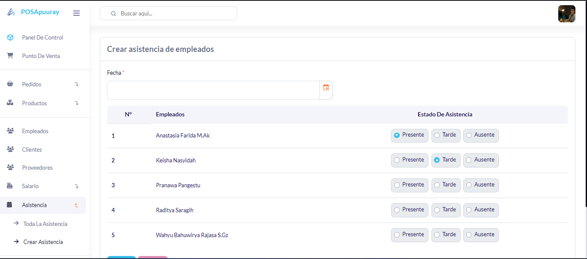
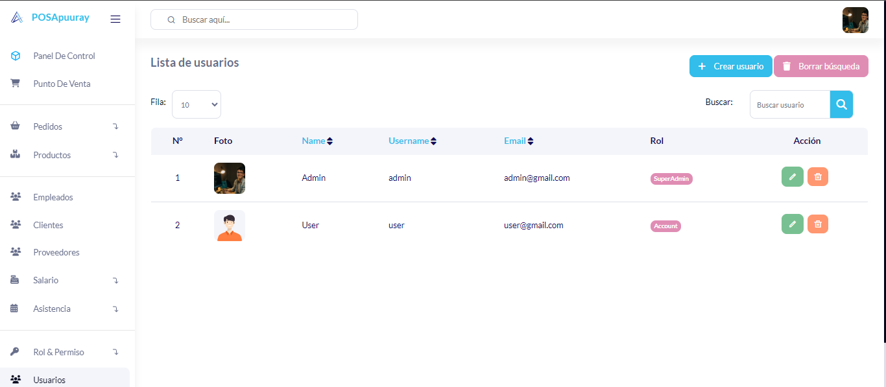

## Sistema Pos

Sistema pos, laravel 10, mysql.








## Características⭐
- punto de venta
- Pedidos
  - Ordenes pendientes
  - Órdenes completas
  - Pendiente de vencimiento
- Gestion de Stocks
- Productos
  - Productos
  - Categorías
- Empleados
- Clientes
- Proveedores
- Salario
  - Salario por adelantado
  - Pagar salario
  - Historial de salario
- Asistencia
- Rol y permiso
- Gestión de usuarios
- Base de datos de respaldo

## Cómo utilizar😎

1.  **Clonar repositorio o descargar**

    ```bash
    $ git clone https://github.com/yorchavez9/sistema-punto-de-venta.git
    ```
1. **Configuración**
    ```bash
    # Ir al repositorio
    $ cd sistema-punto-de-venta

    # Instalar dependencias
    $ composer install

    # Abre con tu editor de texto
    $ code .
    ```
1. **.ENV**

    Cambie el nombre o copie el `.env.example` archivo a `.env`
    ```bash
    # Generar clave de aplicación
    $ php artisan key:generate
    ```
1. **Configuración regional personalizada del farsante**

    Para configurar Faker Locale, agregue esta línea de código al final `.env` archivo.
    ```bash
    # En este caso, la configuración regional es Perú

    FAKER_LOCALE="id_ID"
    ```

1. **Configurar base de datos**

    Configure las credenciales de su base de datos en su archivo `.env`

1. **Base de datos de semillas**
    ```bash
    $ php artisan:migrate:fresh --seed

    #Nota: Si muestra un error, intente volver a ejecutar este comando.
    ```
1. **Crear enlace de almacenamiento**

    ```bash
    $ php artisan storage:link
    ```
1. **Ejecutar servidor**

    ```bash
    $ php artisan serve
    ```
1. **Acceso al sistema**

    Intente iniciar sesión con nombre de usuario: `admin` y password: `password`

## 🚀 Configuración
1. **Gráfico de configuración**

    Abrir documento `./config/cart.php`. Puede establecer un impuesto, número de formato, etc.

1. **Crear enlace de almacenamiento**

    ```bash
    $ php artisan storage:link
    ```
1. **Ejecutar servidor**

    ```bash
    $ php artisan serve
    ```
1. **Login**

    Intente iniciar sesión con nombre de usuario: `admin` y password: `password`

    o usuario: `user` y password: `password`

## 📝 Contactos

Correo: jesusdavid4521@gmail.com
Numero: 3001134675


